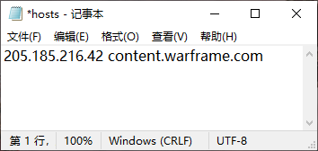
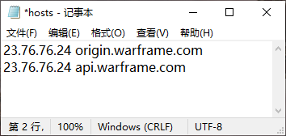
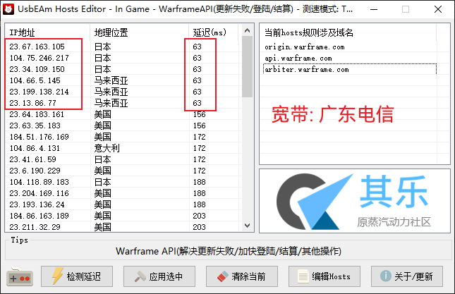
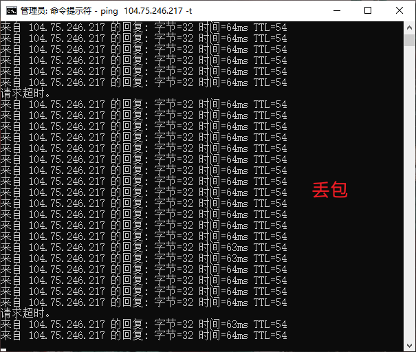
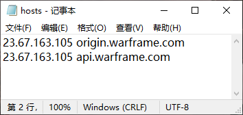

# Warframe Hosts 配置

::: danger 过时
**文章已过时**. 现在大多数情况下, 不需要修改hosts文件.
:::

## 1. 登录失败

`content.warframe.com` 可能会被分配到 `205.185.216.10`
此IP国内几乎都会登录失败

需要在hosts文件 `{{ $frontmatter.hosts }}` 添加一行
``` hosts
205.185.216.42 content.warframe.com
```


## 2. 加速器结算

加速器几乎都是香港节点, 优先选择香港结算服务器

 - 使用 [Censys](https://search.censys.io/search?resource=hosts&q=%28api.warframe.com%29+and+location.country%3D%60Hong+Kong%60) 查找香港结算服务器
 - 使用 [Chinaz](https://ping.chinaz.com/api.warframe.com) 查找结算服务器

例如 `23.76.76.24`
<br>
在hosts文件 `{{ $frontmatter.hosts }}` 添加

``` hosts
23.76.76.24 origin.warframe.com
23.76.76.24 api.warframe.com
```


::: warning 注意
有些加速器加速后, 会自动修改本地hosts文件. 可尝试加速后再修改回来.
:::

## 3. 裸连结算

- 使用 [UsbEAm Hosts Editor](https://www.dogfight360.com/blog/475/) 搜索 `WarframeAPI` 查找IP
- 使用 [Censys](https://search.censys.io/search?resource=hosts&q=api.warframe.com) 查找IP

`电信` `联通` 通常是日本延迟最低, `移动` 则是香港最低



拿到IP后, 使用 `CMD` 测试稳定性. 命令: `ping [IP] -t`

优先级建议: 无丢包 > 低延迟

::: tip 提示
由于 `CMD` 限制1秒1次PING, 往往需要20多秒的时间来测试稳定性.
可以使用 [NetGraph](https://wwe.lanzoui.com/iDdnEv3srgf) 1秒10次PING, 只需要几秒时间就能确定稳定性情况.
:::

::: warning 注意
不同的时间,稳定性可能不一样. 比如: 同一个IP晚上稳定,白天丢包. (可能是[出口宽带](https://baike.baidu.com/item/%E5%87%BA%E5%8F%A3%E5%B8%A6%E5%AE%BD)高峰期的问题)
:::




例如 `23.67.163.105` 在hosts文件 `{{ $frontmatter.hosts }}` 添加
``` hosts
23.67.163.105 origin.warframe.com
23.67.163.105 api.warframe.com
```



## hosts 修改权限

- [百度搜索](https://www.baidu.com/s?wd=hosts%E4%BF%AE%E6%94%B9%E6%9D%83%E9%99%90)
- [Bing搜索](https://cn.bing.com/search?q=hosts%E4%BF%AE%E6%94%B9%E6%9D%83%E9%99%90)